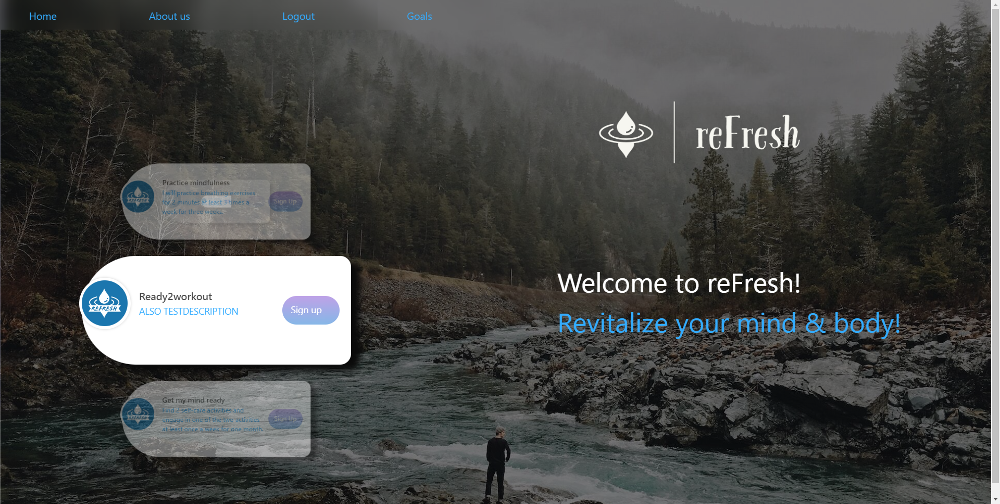

# reFresh; a wellness application.

## Table Of Contents
- [Description](#description)
- [Use](#use)
- [Contributions](#contributions)
- [License](#license)
- [Questions](#questions)
- [Screenshot](#screenshot)

## Description
There are so many apps out there that focus on just fitness or just the mind. We created this app because we care about you as a whole, your spirit, mind, and body. With this app, we are hoping you will be able to establish healthier habits and prioritize your well-being by setting wellness goals to effectively monitor and maintain your journey towards a refreshed and revitalized state of health.

## Use
Our application is a great tool for someone to garner the daily motivation needed to accomplish your everyday goals that they might struggle with.

# Contributions

## License
None (please use responsibly ;)

## Questions

If you have any questions, you can reach me at   https://github.com/RyanTheSCholar  https://github.com/lilym036  https://github.com/safwaan41     
 
  
or reach out to my email at  ryan.business.bowen@gmail.com   mejialily036@gmail.com   safwaan41@gmail.com   
  
###               

## Screenshot

    